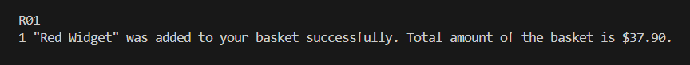

# Acme Widget Shop

A minimal Ruby CLI app for a shopping basket with offers and delivery charge rules.

## Quick Start
- Clone the repo: `git clone https://github.com/Behnam1369/acme-widget.git`
- Go to the root directory of the app: `cd acme-widget`
- Install dependencies: `bundle install`
- Run the app: `ruby main.rb`
  - You will see a welcome message followed by some options.
  
  - You can add a product to the basket by entering its code. 
  
  - At any time you can inspect the basket by entering "p" to see selected products, Applied offers, and Applied delivery charge rules. 
  
  - You can reset the basket by entering "r", and finally you can exit the app by entering "e".
- Run tests: `bundle exec rspec`

## Demo

## Main Logic

### `lib/basket.rb` — `Basket` class
- **`initialize(catalogue, delivery_charge_rules, offers)`**  
  Sets up the basket with a product catalogue, delivery rules, and offers.
- **`add(product_code)`**  
  Adds a product to the basket by code.
- **`total`**  
  Returns the total price of the basket after apllying offers and delivery charges.
- **`print`**  
  Prints the basket contents, and shows calculations for the total amount.
- **`reset`**  
  Empties the basket.

### `lib/offer.rb` — `Offer` class
- **`initialize(name, rule)`**  
  Creates an offer with a name and a rule which is a lambda.
- **`apply(basket)`**  
  Applies the offer’s rule to the basket.
- **`add`**  
  Registers the offer globally.
- **Class methods:**  
  - `self.offers`: Returns all offers.  
  - `self.list`: Alias for `self.offers`.

### `lib/delivery_charge_rule.rb` — `DeliveryChargeRule` class
- **`initialize(name, rule)`**  
  Creates a delivery charge rule with a name and a rule which is a lambda.
- **`apply(basket)`**  
  Applies the rule to the basket.
- **`add`**  
  Registers the rule globally.
- **Class methods:**  
  - `self.delivery_charge_rule`: Returns all rules.  
  - `self.list`: Alias for `self.delivery_charge_rule`.

### `lib/product.rb` — `Product` class
- **`initialize(name, code, price)`**  
  Creates a product with a name, code, and price.
- **`add`**  
  Adds the product to the global catalogue (with validation).
- **Class methods:**  
  - `self.catalogue`: Returns all products.  
  - `self.find(code)`: Finds a product by code.

### `data.rb`
- Instantiates products, offers, and delivery rules, and registers them for use in the app.

### `main.rb`
- Sets up the CLI, creates a `Basket`, and provides the user interface for adding products, printing, resetting, and exiting.

## Author
👤 **Behnam Aghaali**

- GitHub: [https://github.com/Behnam1369](https://github.com/Behnam1369)
- Gitlab: [https://gitlab.com/Behnam1369](https://gitlab.com/Behnam1369)
- LinkedIn: [https://www.linkedin.com/in/behnam-aghaali](https://www.linkedin.com/in/behnam-aghaali)
- Email: [behnam.aghaali@yahoo.com](mailto:behnam.aghaali@yahoo.com)
